<h3> LAUNDRY SERVICE </h3>
A Laundry Service built with #Flutter
<h4>Menu:</h4>
<ul>
<li>OnBoarding</li>
<li>Login</li>
<li>Sign Up</li>
<li>Home</li>
<li>Product List</li>
<li>Note</li>
<li>Review Order</li>
<li>Pickup Location</li>
<li>Pickup and Delivery Date and Time</li>
<li>Payment</li>
<li>Order Details</li>
</ul>

   

   

  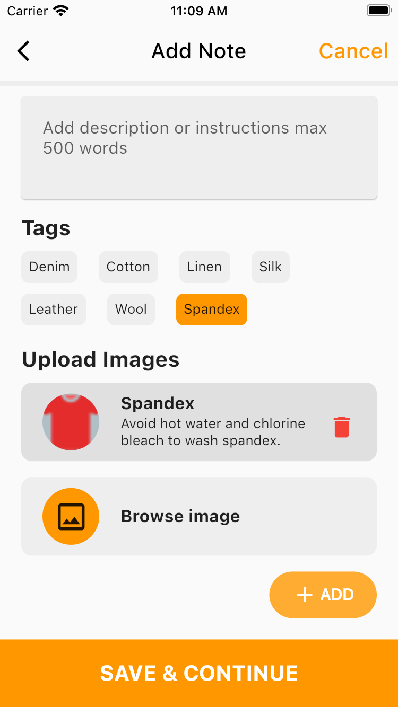 

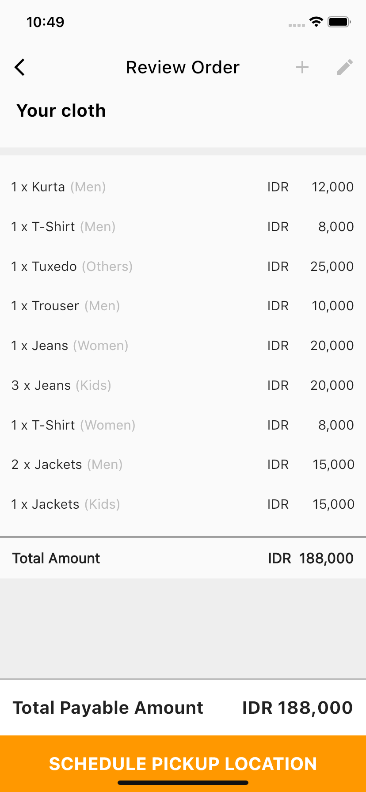  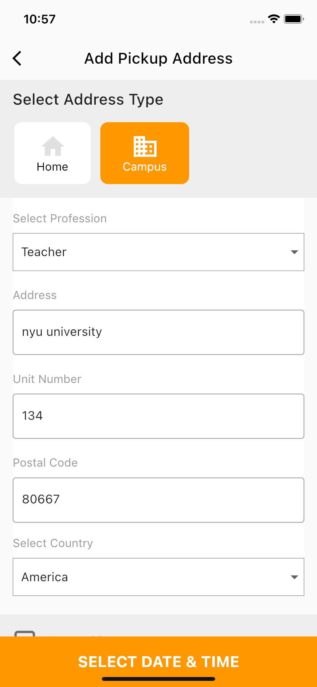 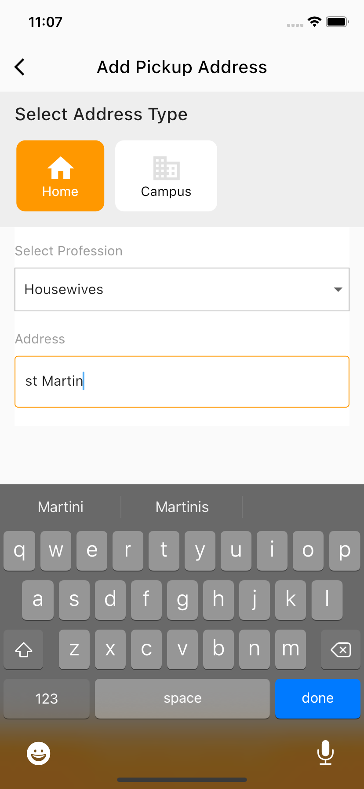

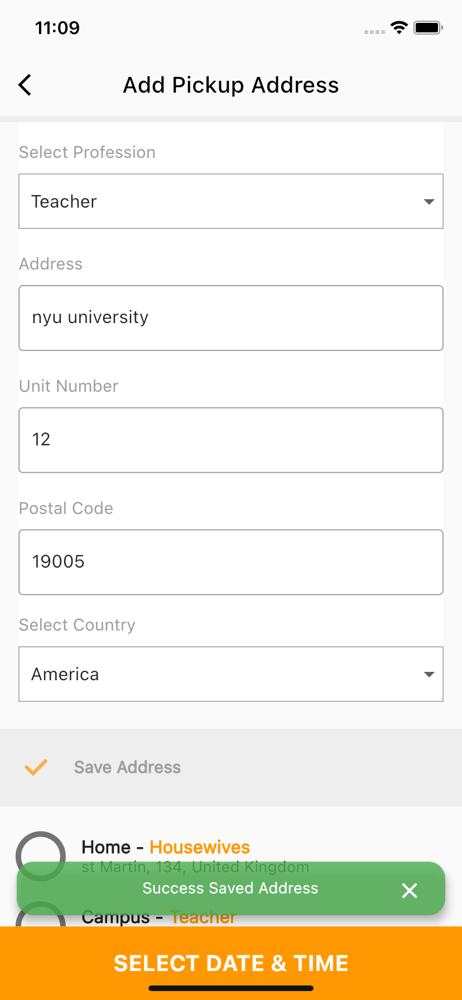  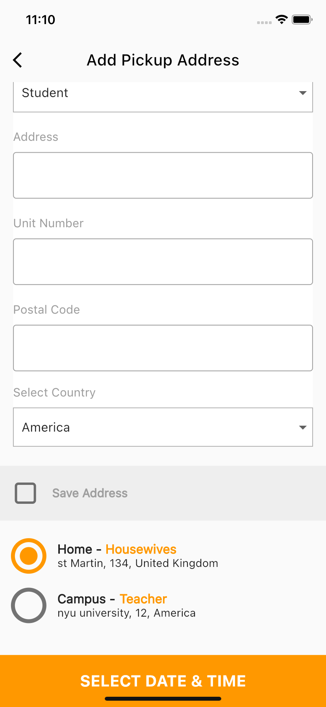 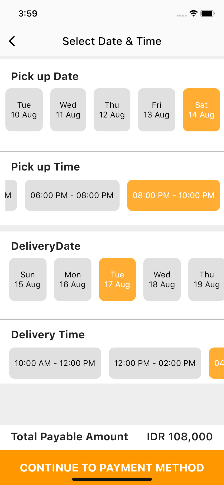

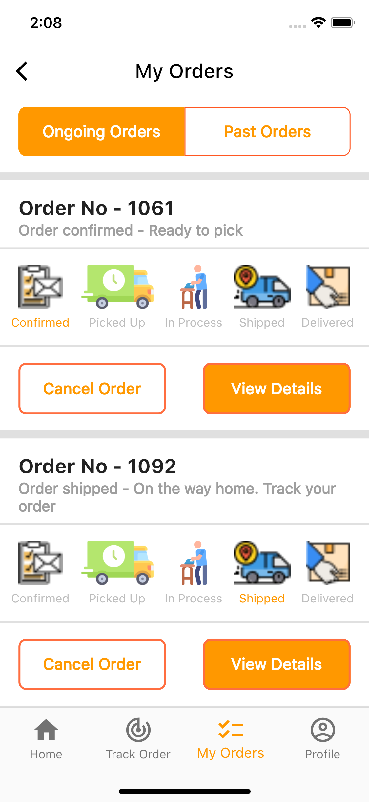  

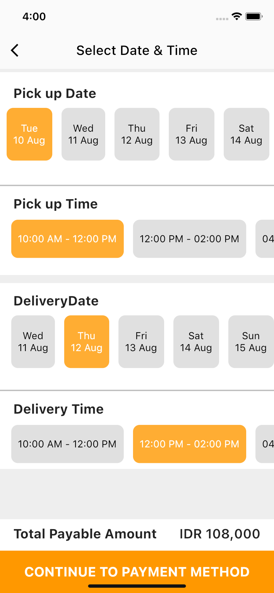  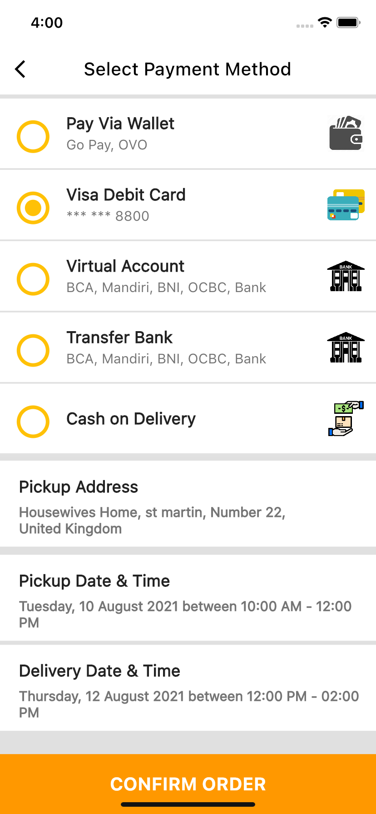 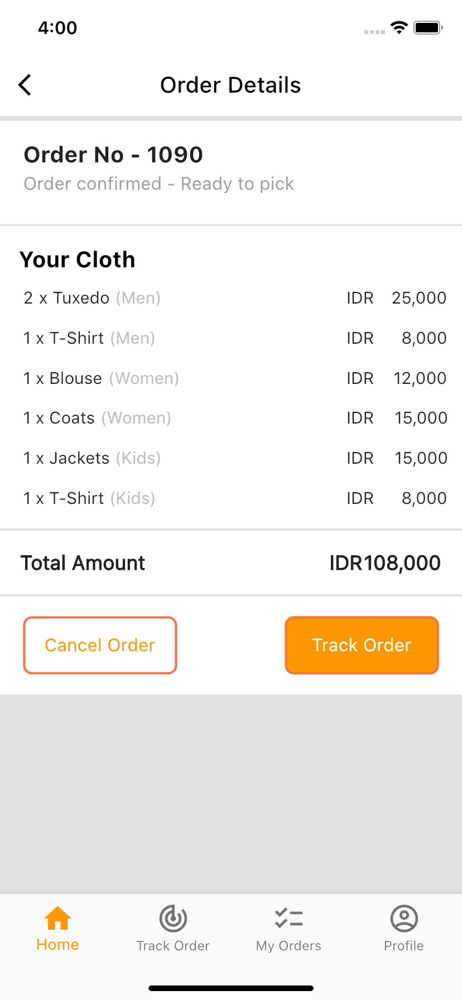 

